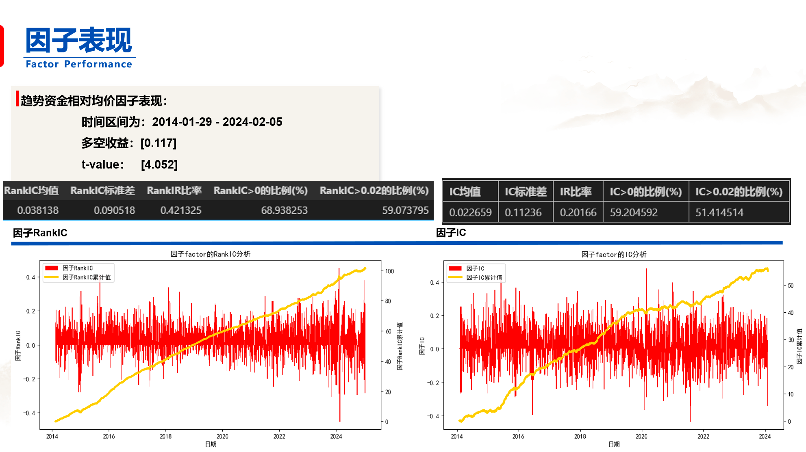
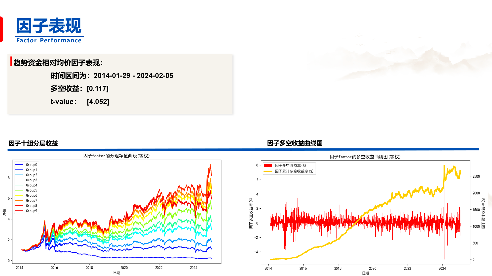

# 国盛证券_金融工程_“量价淘金”选股因子系列研究（五）：基于趋势资金日内交易行为的选股因子

趋势资金是一种极其抽象的概念，很难将其完全归结为某一类固定的交易群体（比如机构）、或者某一种资金形态（比如大单）

回测时间：2024.1.1 - 2024.4.30

股票池：全体A 股（剔除其中的ST股、停牌股、上市未满60个交易日的次新股）

频率：日度

需要数据：分钟频率交易量、分钟频率成交量加权平均价格、市值、中信一级行业

## 1. 如何识别趋势资金的交易行为
如何识别趋势资金的交易行为、追寻趋势资金的脚步，一直是投资者们密切关注的议题。相关的研究报告也层出不穷，比如近些年大家围绕“机构重仓股”、“聪明钱”、“大单净流入”等概念，提出了诸多关于趋势资金的不同定义。

## 2. 重心在“量”
1. 很难将趋势资金完全归结为某一类固定的交易群体、或某一种资金形态。
2. 趋势资金的交易行为，无论其背后的主体是谁，无论其快速成交还是缓慢成交，无论其通过大单成交还是拆成小单成交，**最终都会反映在整体的成交量上**，即趋势资金想要在市场中有所行动，就必须通过释放一定的成交量来实现。 

## 3. 用量定义趋势资金

1. 每个交易日t，回看过去k个交易日t-k、t-(k-1)、……、t-1，计算过去k日分钟成交量序列的m%分位数，定义为成交量阈值；其中，k暂取5，m暂取90； 

2. 将交易日t的每分钟成交量与上述阈值进行对比，若某一分钟的成交量大于上述阈值，则该分钟的交易被视为趋势资金的交易。
## 4. 趋势资金相对均价因子

1. 每个交易日，计算

$$\frac{趋势资金的成交量加权平均价格}{所有分钟的成交量加权平均
价格}-1$$

2. 每月月底回看过去20个交易日，计算上述指标的平均值，并做横截面市值、中信
一级行业中性化处理，得到趋势资金相对均价因子。 

Idea：若因子值较大，则表明趋势资金的交易价格相对较高，其出货的可能性更大，后市看空；若因子值较小，则表明趋势资金的交易价格较低，
其交易行为更有可能是逢低买入，后市看涨。 

## 5. 趋势资金净支撑量因子(表现较差)
1. 计算所有趋势资金分钟收盘价的平均值，筛选趋势资金中、收盘价小于该平均值的分钟，将它们的成交量加总，得到**趋势资金支撑成交量**；
2. 类似地，将趋势资金中、收盘价大于上述平均值的分钟成交量加总，得到**趋势资金阻力成交量**；
3. 每日计算：

$$\frac{趋势资金的成交量趋势资金支撑成交量−趋势资金阻力成交量加权平均价格}{当日流通股本}$$

每日回看过去20个交易日，求20日均值得到趋势资金净支撑量因子。