# 【国盛金工】量化专题：K线形态信息中的alpha

Time: 2024年09月10日

##  1. K线形态分析

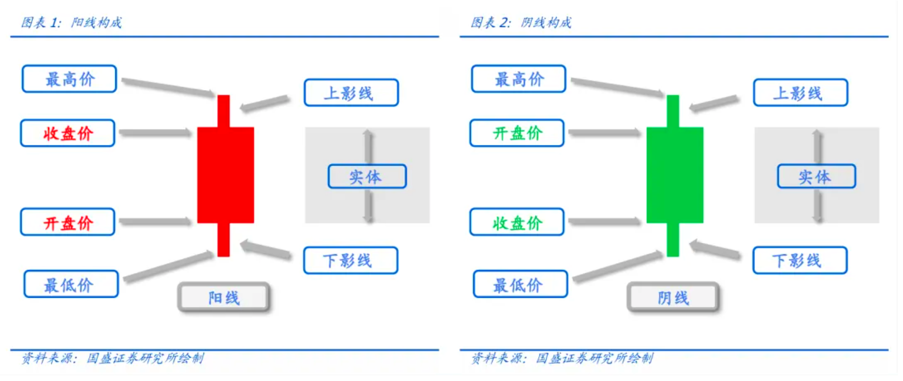

1. 实体宽度：$$body = \frac{abs(open-close)}{preclose}$$

2. 上影线长度：$$upper\ shadow = \frac{high - max(open,close)}{preclose}$$

3. 下影线长度：$$lower\ shadow = \frac{min(open,close) - low}{preclose}$$

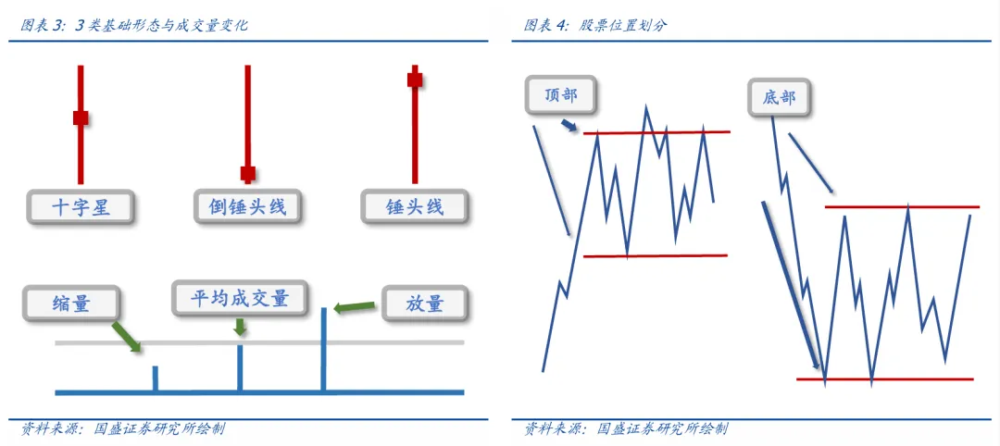

1. **十字星**：箱体宽度≤ 2%、上影线长度≥3%、下影线长度≥ 3%；

2. **锤头线**：箱体宽度≤ 2%、上影线长度≤ 2%、下影线长度≥ 5%；

3. **倒锤头线**：箱体宽度≤ 2%、上影线长度≥ 5%、下影线长度≤ 2%；

成交量变动也是一个重要的信息，我们将股票的放量和缩量行为确认为：

1. **放量**：当日成交额 ≥ "过去20日成交额均值"×(1+20%)；

2. **缩量**：当日成交额 ≤ "过去20日成交额均值"×(1-20%)；

价格是趋势的间接表示，价格顶部和价格底部反映了市场参与者不同的心理预期，在股票价格接近这些关键点位时，投资者会关注于趋势的延续或反转。 

股票价格所处的位置区域也可以定量，我们将顶部和底部确认为： 

1. **顶部区域**：当日收盘价 ≥ "过去1年最高价"× (1-10%)； 

2. **底部区域**：当日收盘价 ≤ "过去1年最低价"× (1+10%)； 

统计了股票在2010年以来股票在顶部位置放量、且出现十字星或者倒锤头线，在底部位置放量并且出现十字星或者锤头线，这些事件后股票在未来20日相对于市场所有股票等权收益的超额表现。

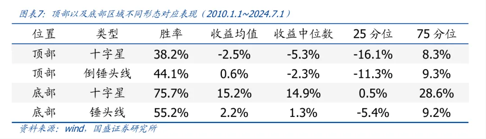

顶部位置的反转形态对应的股票在未来大概率跑输于市场指数，而底部位置的反转形态对应的股票在未来大概率跑赢市场指数，这表明形态的分析对于股票未来的涨跌确实具有显著的预测能力。

## 2. 形态与组合形态 

我们根据实体宽度、上影线和下影线长度这3个变量来表征K线。因此，我们将基于这3个变量对于K线的类型做进一步的划分：

首先，我们根据股票日内涨跌幅大于0、小于0，可以将K线划分为：阳线、阴线；

其次：根据实体宽度：小于1.5%、大于1.5%且小于3%、大于3%，我们可以进一步划分K线为：小阳、小阴、中阳、中阴、大阳、大阴；

最后，根据影线长度大于2%、小于2%，可以划分上影线和下影线为：长上影、短上影、长下影、短下影。

因此，综合3个条件，一根K线总共可以划分为2×3×4共计24种形态。

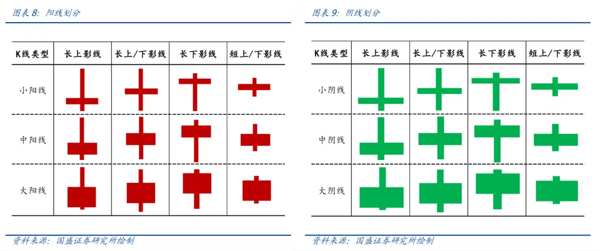

预测目标并非出现股票在呈现形态之后股票次日的涨跌幅，而是希望能预测诸如未来1个月的长窗口收益表现。那么，单根日线数据对于我们而言其所蕴含的信息量太少，受到噪声的影响较大。因此，我们希望使用一系列日线构建成一个组合形态，利用更长窗口的信息。 

组合形态的种类随着日线的数量指数级增长，因此我们构建组合形态之前，我们先对日线进行简单聚合，以降低组合形态的类型数量。

以周线为例，对于连续 5 根日线，基于开、高、低、收价格和成交额 5 个序列:$open_t、high_t、low_t、close_t、amount_t,t=1,2,3,4,5$，聚合得到周线:

$$open = open_1$$

$$close = close_5$$

$$low = min(low_t)$$

$$high = max(high_t)$$

$$amount = \sum amount_t$$

据此，我们将日线汇聚成周线。

简单的单根K周线表征形态太过于单一，其只能表示K线的24种类型，我们用连续的3根周线构成组合形态。

形态是博弈的结果，成交量则是博弈过程激烈强度的量化指标，我们根据“最新成交额/成交额均值”的比例值，定义指标大于1.2为放量，小于0.8为缩量，否则为常量。

对时间做划分，拆分“统计区间”和“验证区间”，我们希望论证在“统计区间”中有效的形态模式在“验证区间”仍然有效，以此表明本文划分的股票的K线形态模式对于股票未来收益具有持续性的预测能力。 

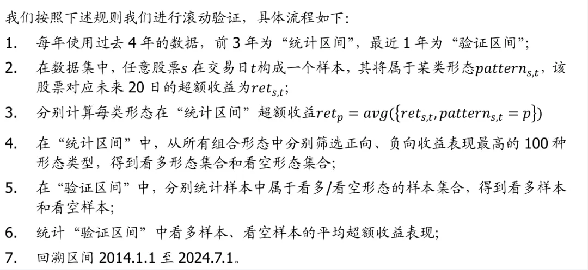

每个月，我们将当月看多/看空样本的超额收益取均值，然后累加月度超额收益，得到超额累计净值，并统计当月的样本数。

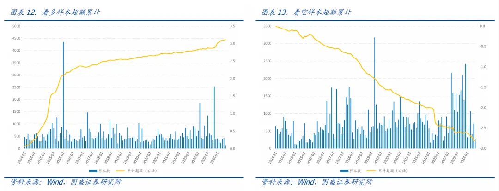

2016年以来，看多样本月均数量约580个，对应未来20日超额收益均值2.5%，2015年超额幅度较高，其后虽然超额累计速度下降但整体上涨趋势不变；而看空样本对应未来20日超额收益长期稳健，均值为-2.2%。

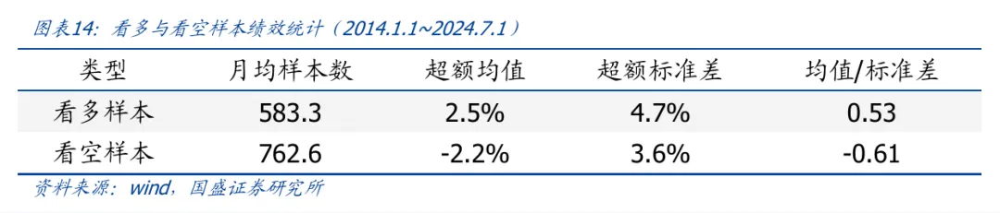

此外，统计每年各形态的超额均值与该形态在上年份超额均值的截面相关性，我们要求每个形态在前后两年都至少拥有100个以上的样本。2012年至2023年，各形态在前后两年的绩效相关性均值达到25%。形态在时间序列上具有稳健且持续的选股绩效。

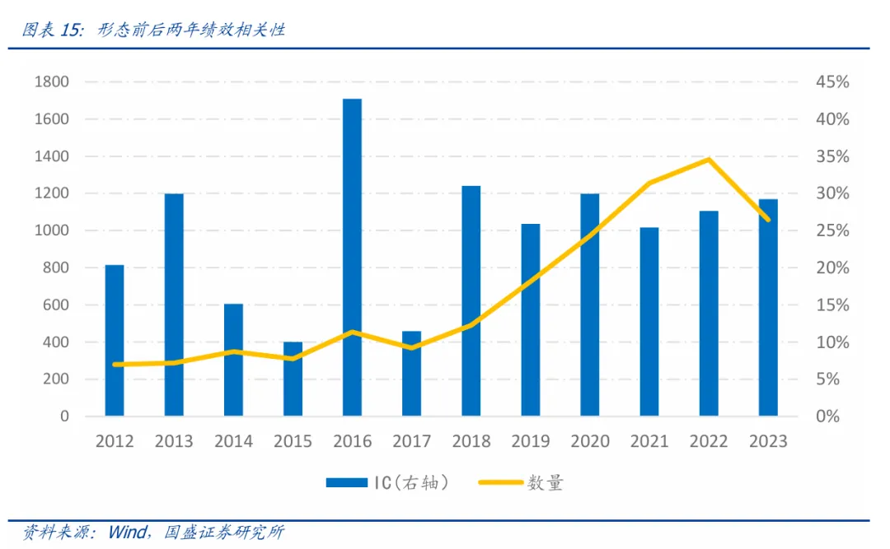

## 3. K线形态举例

下文所指超额收益均为股票未来20日收益相对于所有股票收益均值的超额幅度，胜率指形态样本集中超额收益大于0的比率。

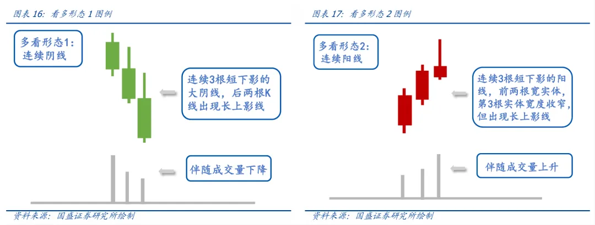

看多形态1是连续阴线的例子，股票呈现连续3根大阴线且后两根阴线表现出长上影线，同时伴随成交量下降。2016年以来该形态未来20日超额收益均值2.50%，胜率为53.9%。

看多形态2是连续阳线举例，股票在2根大阳线后，第3根阳线实体宽度收窄且出现长上影线，同时伴随成交量上升，2016年以来该形态未来20日超额收益均值2.03%，胜率为53.4%。

一般我们认为放量滞涨的股票在顶部更大概率出现趋势的反转，如前文顶部放量倒锤头线所示，在顶部这种股票长期而言将跑输市场平均水平。而我们统计出其在未来有显著正超额收益，这与直观上的理解存在差异。

但看多形态2与传统技术分析的观点存在两个较为明显的差异。首先，传统技术分析结论更多聚焦于日线，而我们上述结论基于周线得出；其次，技术分析认为股票在顶部放量滞涨存在趋势反转的可能性前提在于股票是处于价格顶部，其前提假设包含股价的位置信息，而看多形态2完全基于价和量的形态构建，不考虑股价的位置。

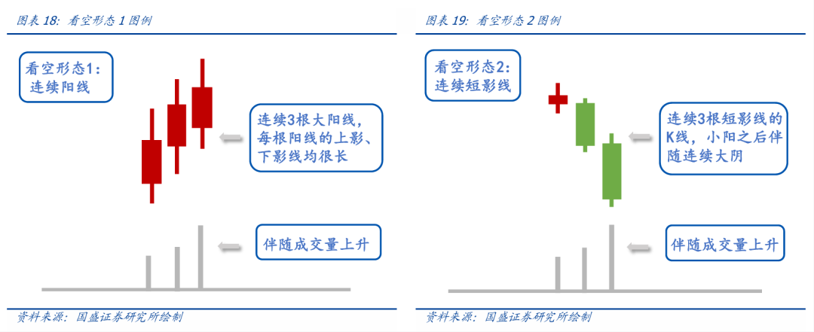

**看空形态1**为连续阳线看空的举例，股票出现连续3根大阳线，且每根阳线的上下影线都很长，同时伴随成交量上升。该形态未来20日超额收益均值-5.16%，胜率28.2%。

看空形态1可以从因子逻辑理解，其alpha来源与低波因子相一致。形态连续3周都呈现出幅度较大的上影线和下影线，其本质上指向短期呈现出高波动的个股，作为低波因子的空头，高波动股票在因子视角下确实长期稳健跑输市场平均水平。但该形态与低波因子的逻辑又不完全一致，只在形态节点确认高波股票的空头信息。

**看空形态2**是股票连续短影线放量大跌的举例。股票在小阳线之后，出现连续2个确定性的放量大跌，跌的幅度较深且上下影线都很短。这类股票在短期大概率继续下跌，形态在未来20日的超额收益均值-5.04%，胜率41.3%。

看空形态2的第一根短影线小阳周线意味着股票开始处于低波动的小幅上涨趋势中，若这时候股票出现放量大跌，其下跌趋势未来将延续。类似的图表21中，我们展示了连续2根短影小阳线后，出现放量下跌的形态，股票未来下跌幅度将更大，超额收益均值为-8.8%，胜率为25.4%。

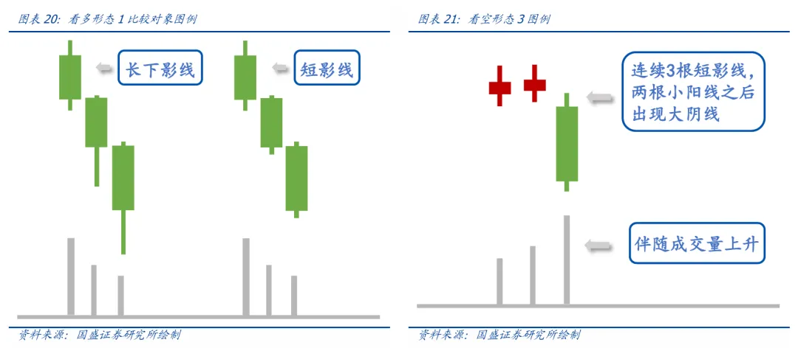

## 4. 形态选股因子

基于前文分析，我们希望根据股票K线形态构建实时动态的形态评价体系，进而基于形态模式得到选股因子CSP（candlestick pattern）。

### 4.1 形态选股因子

以连续3根周线构建组合形态为例，因子构建使用的基础数据如下：
1. 任意股票 s 在交易日 t 的通过回溯过去 15 根日线，聚合成 3 根周线后构建得形态模式为 $pattern_{s,t}$ ，该样本对应未来 20日超额收益为 $ret_{s,t}$ ;

2. 形态 $pattern_{s,t}\in PatternSet$ ,其中 $PatternSet = \{p_i,i = 1,...,41472 \}$ 为前文定义所有的K线形态构建成的集合(24x24x72);

那么，因子构建具体流程如下:

1. 每个交易日根据过去 3 年（不包括最近20天）样本数据，统计各类形态 $p_i$ 的全部股票在future20_return的表现，得到形态 $p_i$ 对应样本的收益均值及标准差 ;

2. 计算各类型形态模式对应的收益信息比率: $ir_{p_i} = avg(ret_{p_i})/std(ret_{p_i})$ ;

3. 股票s在T日的K线形态模式因子值$CS\ Pattern$定义为: $csp_{s,T}= {\textstyle \sum_{t = T - 19}^{t = T}ir_{pattern_{s,t}}} $ ;

4. 因子值截面上在对行业和市值回归取残差，作为最终选股信号;

### 4.2 多周期形态与多维度评价

在4.1中，我们用连续5根日线聚合成周线，进而周线划分基础形态，借助于3个基础形态构建形态组合，得到CSP因子。而技术分析对于形态的分析不局限在周线，往往分钟、小时、日、周等不同周期的K线形态之间互相佐证，进而得到最终的判断。

因此，我们的视角可以更加多样。通过聚合i根日线、划分基础形态、构建组合形态，在此前提下我们从1日线看到10日线，可以得到10个形态观点 $CSP_i$ 。

最终，综合多聚合周期以及多维度标签，我们定义复合 $CSP$ 因子如下:

1. 基于不同周期聚合日线，得到多元选股信号 $csp_{label} = \sum csp_{i,label}$ ,其中 $csp_{i,label}$ 为给定标签的前提下通过 i 根日线聚合成一根 K 线;

2. 综合不同维度评价标签，得到多元选股信号$\sum csp_{label}$,其中 $csp_{label}$ 为标签在不同周期聚合信号的均值。

### 4.3 行业轮动应用

形态信息确认了股票短期的交易信号，事实上形态的作用不局限在股票这类单一资产标的上，我们发现形态对于行业指数短期的收益也具有显著性的预测能力。

行业指数相对于股票在截面上数量较少，如果直接识别行业指数的K线形态，构建行业间的比较关系，这将产生更多的噪音。

为此，我们汇总行业指数成分的形态信号，得到行业指数评价指标:

$$CSP_{ind_i}=avg(csp_s,s \in ind_i)$$

其中 $csp_s$ 为股票 s 的形态打分取值。

在中信一级行业指数中（剔除综合以及综合金融），我们检验CSP行业因子对于行业指数未来2周窗口的收益预测能力，对比因子前1/4组别多头的7个行业等权收益相比于全行业等权收益的绩效表现。

